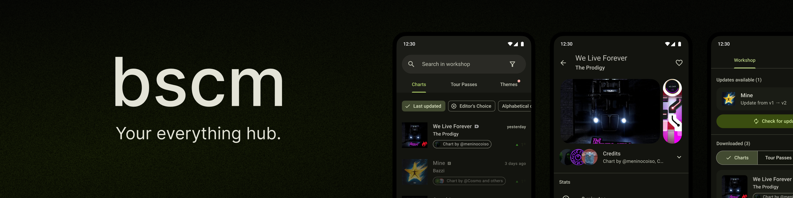

# 📦 bscm

**bscm** is a lightweight, community-made hub for everything Beatstar — built by players, for players.
It’s still early, but the goal is clear: a clean, central place to explore and manage charts beyond the game.

#### 🧭 Availability
The project is currently available through two platforms:
- 📱 Android App – Explore charts, browse content, and receive in-app updates
- 🖥️ Web Dashboard – Publish and manage community content. Ideal for creators.

---

## 🚀 Features

- **Browse a growing chart collection**  
  Search, filter and order by any parameter you may need
- **View detailed chart data**  
  From duration to number of notes, have all the data in one place
- **In-app update system**  
  Get the latest changes from content creators at your fingertips
- **Lightweight, mobile-friendly UI**  
  Enjoy a clean interface designed from the ground up
- **Built-in mod management, easier than ever**  
  Available in future releases
- **Link everything on a single account**  
  Available in future releases

---

## 📱 Installation

> [!NOTE]
> Due to the nature of the project design, downloads are only available for Android devices.
> We do not plan to develop a version for iOS devices at the current state of the project.

1. Download the latest APK from the [Releases](https://github.com/your-username/bscm/releases) page  
2. Install it on your Android device  
3. Launch and explore! 🎉

---

## 🛠 Contributing

Want to help? You’re welcome!

- Found a bug? Open an [issue](https://github.com/bscommunity/bscm/issues)
- Have a feature idea? Suggest or submit a PR
- Still no logo! If you’re into design, we’d love to see your take on one.
